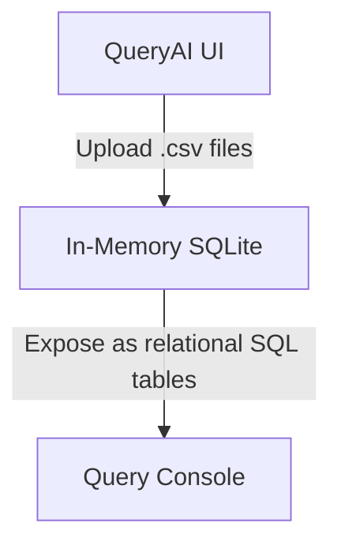

# 🔌 QueryAI Database Integration Walkthrough

This walkthrough outlines how to integrate and connect **any SQL database** (MySQL, PostgreSQL, MS SQL Server, Oracle, local SQLite files, or CSVs) with the QueryAI Text-to-SQL console.

---

## 🧭 General Connection Steps

1. **Install Driver**: Run the specific `pip install` command on your system terminal for the database type.
2. **Access UI**: Run the QueryAI Streamlit application using `streamlit run app.py` and navigate to the top expansion panel: **🔌 Database Connection**.
3. **Select Engine**: Choose your database type from the drop-down selector.
4. **Enter Credentials**: Supply host, port, database schema name, username, and password.
5. **Test**: Click **🧪 Test Connection** to verify connection stability.
6. **Connect**: Click **🚀 Connect & Load Schema** to extract schema metadata and enable English queries.

---

## 🐬 1. MySQL / MariaDB Integration


### ⚙️ Prerequisites
MySQL connection utilizes the `pymysql` driver (a pure-Python database client).
Run the following installation command in your terminal:
```bash
pip install pymysql
```

### 📋 Connection Setup Grid
| Field | Value / Format | Example |
| :--- | :--- | :--- |
| **Select Database Type** | `🐬 MySQL` | Selector choice |
| **Host / Server IP** | Hostname or server IP address | `127.0.0.1` or `db.company.com` |
| **Port** | Default: `3306` | `3306` |
| **Database Name** | Name of the database schema | `ecom_sales` |
| **Username** | Database user with `SELECT` permissions | `read_only_user` |
| **Password** | Password matching the username | `••••••••` |
| **Advanced Options** | Custom params (e.g. `charset=utf8mb4`) | `charset=utf8mb4` |

### 🛠️ Common Troubleshooting
* **Error: Access Denied**: Ensure the user has been granted privileges to connect from remote IPs (e.g., `'read_only_user'@'%'`). Use `GRANT SELECT ON ecom_sales.* TO 'read_only_user'@'%';`.
* **Error: Connection Timeout**: Verify that your MySQL server configuration (`my.cnf` or `my.ini`) has `bind-address` set to `0.0.0.0` or includes your client's IP, and that port `3306` is open through system firewalls.

---

## 🐘 2. PostgreSQL Integration


### ⚙️ Prerequisites
PostgreSQL connection utilizes the `psycopg2-binary` driver.
Run the following installation command in your terminal:
```bash
pip install psycopg2-binary
```

### 📋 Connection Setup Grid
| Field | Value / Format | Example |
| :--- | :--- | :--- |
| **Select Database Type** | `🐘 PostgreSQL` | Selector choice |
| **Host / Server IP** | Server hostname or IP address | `localhost` or `pg-instance.postgres.database.azure.com` |
| **Port** | Default: `5432` | `5432` |
| **Database Name** | Target database name | `production_db` |
| **Username** | Database user | `postgres` |
| **Password** | Password | `••••••••` |
| **Advanced Options** | SSL parameters (e.g. `sslmode=require`) | `sslmode=require` |

### 🛠️ Common Troubleshooting
* **Error: Password Authentication Failed**: Verify credentials. Note that PostgreSQL usernames are case-sensitive.
* **Error: No pg_hba.conf entry**: Edit the server's `pg_hba.conf` configuration file to allow connection requests from the client's host/IP address.
* **Error: SSL required**: If connecting to managed instances (like AWS RDS or Azure Postgres), add `sslmode=require` into the **Advanced Options** text field.

---

## 🪟 3. Microsoft SQL Server (MSSQL) Integration


### ⚙️ Prerequisites
SQL Server connection utilizes the `pymssql` driver.
Run the following installation command in your terminal:
```bash
pip install pymssql
```

### 📋 Connection Setup Grid
| Field | Value / Format | Example |
| :--- | :--- | :--- |
| **Select Database Type** | `🪟 Microsoft SQL Server` | Selector choice |
| **Host / Server IP** | Server Hostname (or host\instance name) | `DESKTOP-ABC\SQLEXPRESS` or `10.0.0.15` |
| **Port** | Default: `1433` | `1433` |
| **Database Name** | Database catalog | `HospitalRecords` |
| **Username** | SQL Server Authentication user | `sa` |
| **Password** | Password | `••••••••` |
| **Advanced Options** | Trust local certificate parameters | `TrustServerCertificate=yes` |

### 🛠️ Common Troubleshooting
* **Error: Adaptive Server connection failed**: Ensure SQL Server Authentication mode is enabled (Mixed Mode) in SQL Server Management Studio (SSMS).
* **SSL Validation Failures**: For local development servers with self-signed SSL certificates, you **must** expand **Advanced Options** in QueryAI and input:
  ```txt
  TrustServerCertificate=yes
  ```
* **Dynamic Ports**: If using SQLEXPRESS without a static port, enable SQL Server Browser service and check port configuration in SQL Server Configuration Manager.

---

## 🔴 4. Oracle SQL Integration


### ⚙️ Prerequisites
Oracle SQL utilizes the thin client mode supported by the standard `oracledb` library.
Run the following installation command in your terminal:
```bash
pip install oracledb
```

### 📋 Connection Setup Grid
| Field | Value / Format | Example |
| :--- | :--- | :--- |
| **Select Database Type** | `🔴 Oracle SQL` | Selector choice |
| **Host / Server IP** | Hostname or IP address | `192.168.1.50` |
| **Port** | Default: `1521` | `1521` |
| **Database Name** | Oracle Service Name or System ID (SID) | `ORCL` or `XE` |
| **Username** | Oracle DB schema username | `SYSTEM` |
| **Password** | Oracle account password | `••••••••` |
| **Advanced Options** | Connection parameters | *Leave Blank* |

### 🛠️ Common Troubleshooting
* **Error: ORA-12514 / ORA-12505 (TNS: listener does not currently know of service)**: Ensure that your **Database Name** field accurately contains the Service Name (default `ORCL` or `XE` for express versions) and matches the configurations in `listener.ora` / `tnsnames.ora`.
* **Account Locked**: If your Oracle user account is locked, run: `ALTER USER username ACCOUNT UNLOCK;` in SQL*Plus as SYSDBA.

---

## 📁 5. SQLite File Integration


### ⚙️ Prerequisites
* **Zero Driver Installs**: SQLite is natively supported by Python's standard library. No packages are required!

### 📋 Connection Setup Grid
| Field | Value / Format | Example |
| :--- | :--- | :--- |
| **Select Database Type** | `📁 SQLite (File)` | Selector choice |
| **SQLite File Path** | Absolute operating system path | `C:/Users/DELL/projects/text-to-sql/database/hospital.db` |

### 🛠️ Common Troubleshooting
* **Error: OperationalError (no such table)**: SQLite creates an empty file if the provided path is incorrect but write permissions allow it. Always double-check that you are using an **absolute path** and that it points to a database file with populated tables.
* **Error: Permission Denied**: Verify that the operating system user running Streamlit has read and write permissions to the folder containing the database file.

---

## 📄 6. CSV File Integration



### ⚙️ Prerequisites
* **Supported Natively**: Uses Python's standard `sqlite3` and Pandas to parse columns and dynamically mount databases.

### 📋 Connection Setup Grid
1. Navigate to **Select Database Type** and pick `📄 CSV Upload`.
2. Drag and drop any `.csv` file (or select multiple files at once).
3. QueryAI maps the file name into the database table name (e.g. `customer_data.csv` becomes table `customer_data`).
4. Click **📊 Load CSV Data**.

### 🛠️ Common Querying Guide
Since files are converted into an in-memory database, you can write English queries combining multiple tables seamlessly:
* *Example query on a single file:* `"Show the top 10 highest-paid employees in employees_data"`
* *Example query joining two uploaded files:* `"Join sales_data and products on product_id and show the total revenue grouped by category"`

---
> **Integration Walkthrough Artifact**: [database_setup_walkthrough.md](file:///C:/Users/DELL/.gemini/antigravity-ide/brain/59eb22ff-22da-4d60-a9f3-db270cc0986d/database_setup_walkthrough.md)
